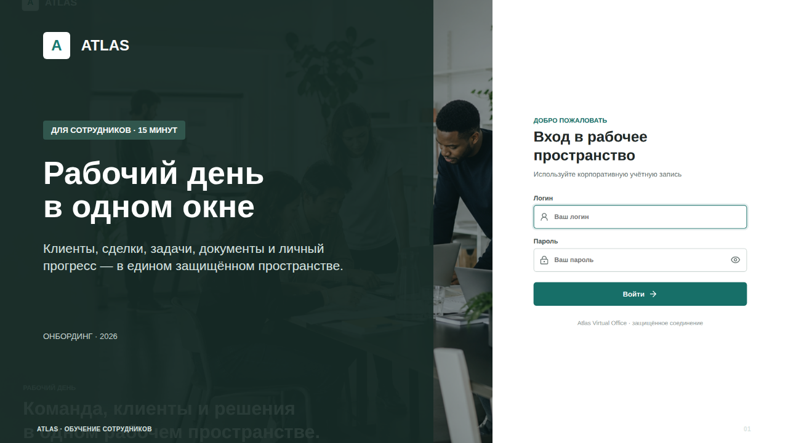

# Онбординг сотрудников Atlas

Готовая русскоязычная презентация для первого знакомства сотрудников с Atlas.
Рекомендуемая продолжительность — 15 минут и короткая практика после показа.

## Файлы

- [PowerPoint](Atlas_Onboarding_Employees_RU.pptx) — редактируемые слайды и заметки спикера.
- [PDF](Atlas_Onboarding_Employees_RU.pdf) — версия для просмотра и рассылки.
- [HTML](Atlas_Onboarding_Employees_RU.html) — браузерная и печатная версия.
- [Превью слайдов](rendered/) — изображения для быстрого просмотра без PowerPoint.
- [Скриншоты Atlas](screens/) — исходные экраны, использованные в презентации.

## Сценарий показа

1. Объяснить роль Atlas в ежедневной работе.
2. Показать первый вход и границы доступа сотрудника.
3. Пройти маршрут: дашборд → CRM → воронка → задачи → документы.
4. Объяснить KPI, достижения, присутствие и политику мониторинга.
5. Завершить чек-листом и практикой: открыть профиль и перевести учебную задачу в статус «В работе».

Скриншоты рабочих разделов сделаны в безопасном демонстрационном профиле
`Сотрудник` и не содержат производственных данных. Экран входа снят с действующего
развёртывания Atlas. Раздел сообщений показан как обзор входящих: внешние каналы
требуют корпоративной настройки, а отправка внешних ответов в текущей версии
недоступна.

