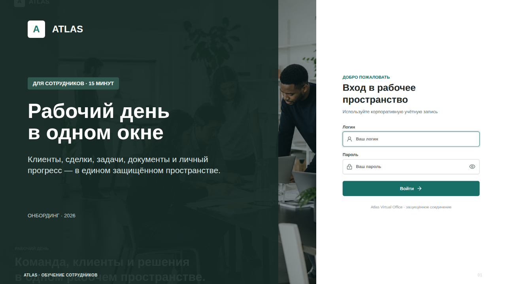

# Онбординг сотрудников Atlas

Готовая русскоязычная презентация для первого знакомства сотрудников с Atlas.
Рекомендуемая продолжительность — 15 минут и короткая практика после показа.

## Файлы

- [PowerPoint](Atlas_Onboarding_Employees_RU.pptx) — редактируемые слайды и заметки спикера.
- [PDF](Atlas_Onboarding_Employees_RU.pdf) — версия для просмотра и рассылки.
- [HTML](Atlas_Onboarding_Employees_RU.html) — браузерная и печатная версия.
- [Превью слайдов](rendered/) — изображения для быстрого просмотра без PowerPoint.
- [Скриншоты Atlas](screens/) — исходные экраны, использованные в презентации.

## Сценарий показа

1. Объяснить роль Atlas в ежедневной работе.
2. Показать первый вход и границы доступа сотрудника.
3. Пройти маршрут: дашборд → CRM → воронка → задачи → документы.
4. Объяснить KPI, достижения, присутствие и политику мониторинга.
5. Завершить чек-листом и практикой: открыть профиль и перевести учебную задачу в статус «В работе».

> **Обновление: несколько воронок.** Раздел «Воронка» теперь может содержать
> несколько воронок продаж. Переключатель воронки находится в шапке раздела и
> показывает только воронки, к которым у сотрудника есть доступ. Настраивать
> воронки, этапы и доступ может только директор. Слайды и скриншоты будут
> обновлены отдельно.

> **Обновление: доски задач.** Задачи теперь живут на досках. У каждого отдела
> есть доска «Задачи отдела», а руководитель отдела может создать дополнительные
> доски со своими этапами и пригласить сотрудников других отделов. Все участники
> доски видят все её задачи и могут их перемещать; у задачи может быть несколько
> исполнителей. Раздел «Мои задачи» показывает всё, что назначено вам, со всех
> досок в трёх колонках: «Не начато», «В работе», «Готово». Раздел «Доски»
> показывает доску целиком. Слайд 8 будет обновлён отдельно.

Скриншоты рабочих разделов сделаны в безопасном демонстрационном профиле
`Сотрудник` и не содержат производственных данных. Экран входа снят с действующего
развёртывания Atlas. Все денежные суммы показаны в украинских гривнах (`UAH`, `₴`).
Раздел сообщений показан как обзор входящих: внешние каналы
требуют корпоративной настройки, а отправка внешних ответов в текущей версии
недоступна.

